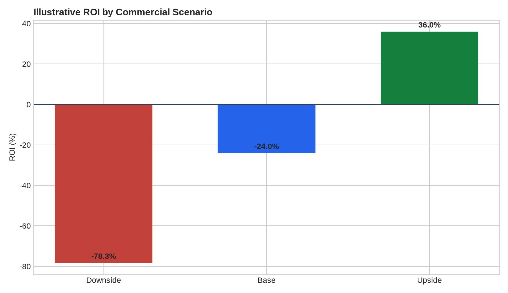
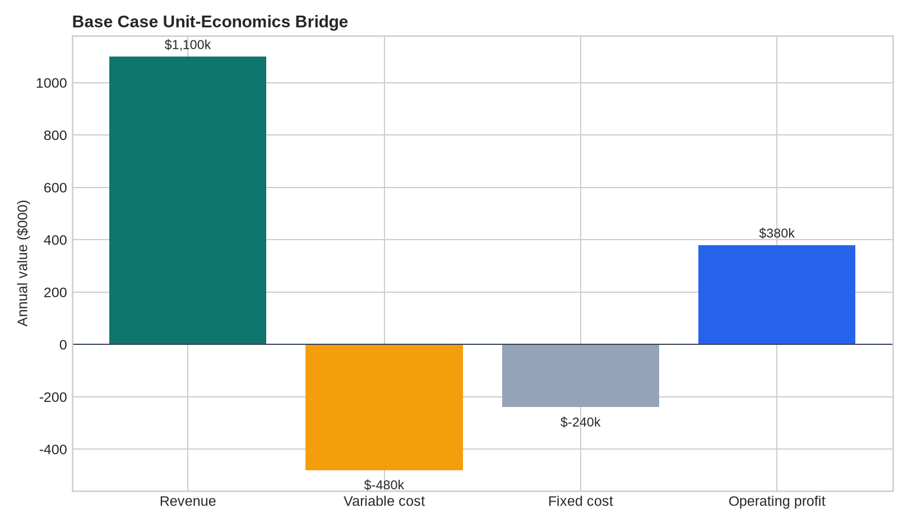
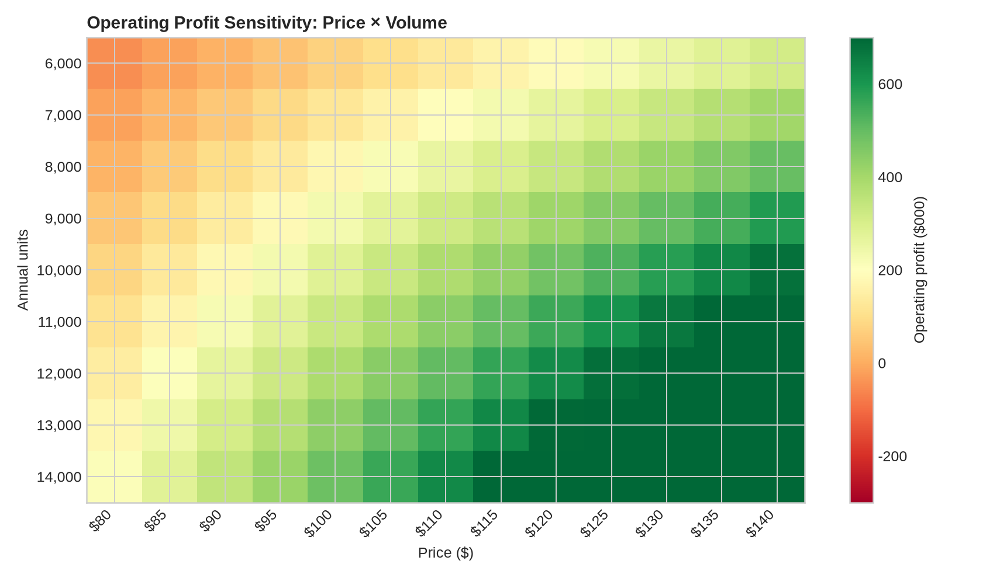

# Pricing & ROI Analytics Engine

> Decision-support engine for pricing, unit economics, break-even analysis, contribution margin, ROI, and sensitivity analysis.

## Business Problem

Pricing decisions fail when revenue, variable cost, fixed cost, volume, and customer economics are evaluated independently. This engine connects them into one decision model.

## Analytical Questions

- What price maximizes contribution under stated assumptions?
- What volume is required to break even?
- How sensitive is ROI to price, cost, and volume changes?
- Which customer or product assumptions drive the result?

## Deliverables

- Unit-economics calculator
- Break-even engine
- Price/volume sensitivity matrix
- ROI scenarios
- Margin bridge
- Decision memo template

## Suggested Repository Structure

```text
pricing-roi-analytics-engine/
├── data/
├── notebooks/
├── src/
├── tests/
├── outputs/
├── README.md
└── requirements.txt
```

## Stack

Python, pandas, NumPy, Plotly, financial modelling concepts

## Method

1. Define the decision context and metric definitions.
2. Profile and validate the data.
3. Build reproducible transformations and calculations.
4. Quantify the main drivers, scenarios, or failure modes.
5. Validate outputs and document limitations.
6. Produce an executive-ready decision narrative.

## Portfolio Standard

Use synthetic or public data with documented provenance. Clearly distinguish measured results from assumptions and illustrative scenarios.

## Sample Outputs

The repository includes a reproducible illustrative pricing analysis generated by `python src/generate_outputs.py`. The inputs are synthetic assumptions for a fictional product and are not empirical demand estimates.

### Executive summary

See [`outputs/executive_summary.md`](outputs/executive_summary.md) for the decision readout, controls, and limitations.

### Visual outputs







### Reproducible files

- [`data/assumptions.csv`](data/assumptions.csv) — scenario inputs
- [`outputs/scenario_economics.csv`](outputs/scenario_economics.csv) — revenue, contribution, break-even, and ROI
- [`outputs/price_volume_sensitivity.csv`](outputs/price_volume_sensitivity.csv) — price/volume sensitivity grid
